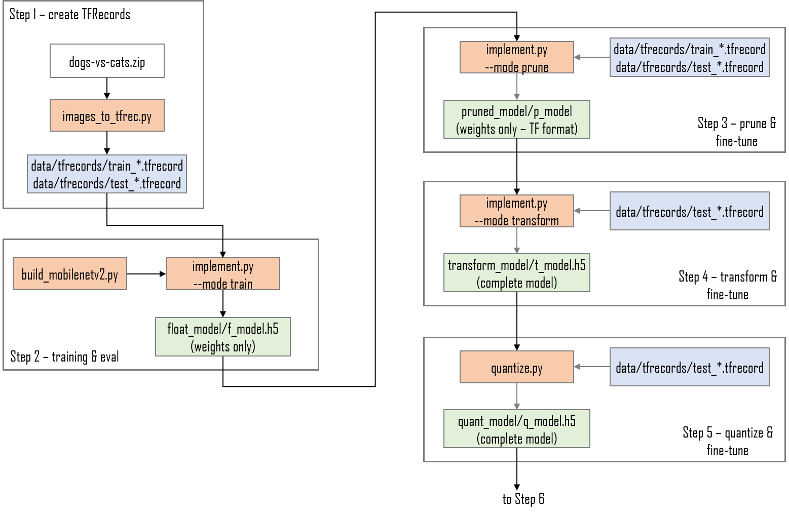
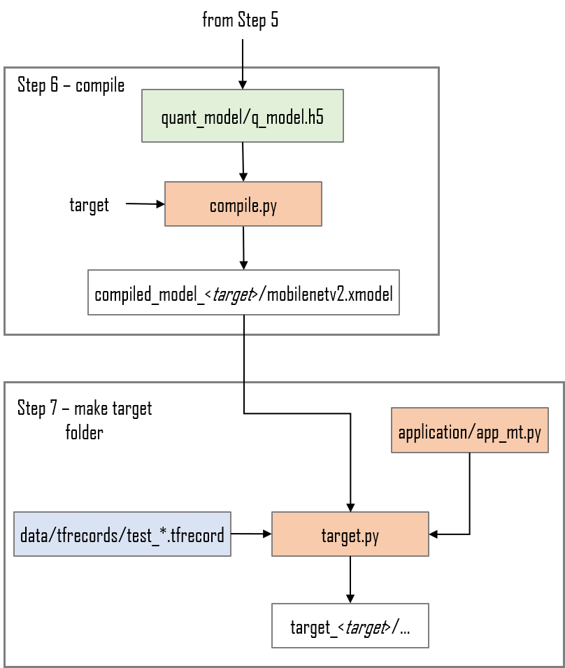

<!--
Copyright 2022 Xilinx Inc.
 
Licensed under the Apache License, Version 2.0 (the "License");
you may not use this file except in compliance with the License.
You may obtain a copy of the License at

http://www.apache.org/licenses/LICENSE-2.0
 
Unless required by applicable law or agreed to in writing, software
distributed under the License is distributed on an "AS IS" BASIS,
WITHOUT WARRANTIES OR CONDITIONS OF ANY KIND, either express or implied.
See the License for the specific language governing permissions and
limitations under the License.

Author: Mark Harvey, Xilinx Inc
-->
<table class="sphinxhide">
 <tr>
   <td align="center"><h1>Vitis AI Tutorials</h1>
  </td>
 </tr>
 <tr>
 <td align="center"><h1>TensorFlow2 AI Optimizer example using Keras</h1>
 </td>
 </tr>
</table>


## Current Status

+ Vitis-AI version: 2.5 with patch (see run_all.sh)
+ Platforms: ZCU102
+ Network: MobileNetV2
+ Dataset:  [Kaggle dogs-vs-cats](https://www.kaggle.com/c/dogs-vs-cats/data)


## Introduction

The Vitis-AI Optimizer can optimize convolutional neural networks (CNN) by exploiting redundancies and near-zero parameters to reduce the number of mathematical operations required to execute the network. This process is often known as 'pruning'. The reduction of mathematical operations leads to several benefits:

  + Increased throughput.
  + Reduced latency.
  + Reduced memory footprint of the compiled model.
  + Reduced number of accesses to memory.

This tutorial will show you how to use Xilinx's AI Optimizer for TensorFlow2 to prune a MobileNetV2 CNN by 60% whilst maintaining the original floating-point accuracy.

The scripts provided in this design will allow users to either run a complete pruning flow or to run a baseline design without pruning. Having the baseline design is useful to provide a comparison of performance and accuracy with the pruned design.

The run_baseline.sh shell script creates the baseline design whereas run_pruning.sh will prune the Keras MobileNetV2 design by approximately 50%. Users are invited to examine both scripts to get an idea of the differences between the two flows.

The remainder of this tutorial is dedicated to running the pruning flow.

## TensorFlow2 AI Optimizer design steps

Pruning a CNN is an iterative process and requires an initial analysis phase in which the trained CNN is analysed using the test dataset and then is pruned in steps. The following diagrams summarize the complete TensorFlow2 AI Optimizer flow when using Keras:


<p align="center">
 
</p>
<p align="center">
 
</p>


## Before You Begin


The host machine has several requirements that need to be met before we begin. You will need:

  + A license for the Vitis-AI Optimizer tool - contact your Xilinx sales representative to obtain one.

  + An x86 host machine with a supported OS - see [System Requirements](https://github.com/Xilinx/Vitis-AI/blob/master/docs/learn/system_requirements.md).

  + The host machine will require Docker to be installed and the Vitis-AI GPU docker image to be built - see [Getting Started](https://github.com/Xilinx/Vitis-AI#getting-started).

  + A GPU card suitable for ML training - a GPU with at least 8GB of memory is recommended.

  + If you plan to use a Zynq evaluation board, it should be prepared with the board image as per the [Step2: Setup the Target](https://github.com/Xilinx/Vitis-AI/tree/master/setup/mpsoc/VART#step2-setup-the-target) instructions for Zyn boards.
  
  + If you plan to use the Versal VCk190 evaluation board, it should be prepared with the board image as per the [Step2: Setup the Target](https://github.com/Xilinx/Vitis-AI/tree/master/setup/vck190#step2-setup-the-target) instructions for the VCK190.
  
  + For the Alveo accelerator cards, follow the [Setup Alveo Accelerator Card](https://github.com/Xilinx/Vitis-AI/tree/master/setup/alveo) instructions.

  + For the VCK5000 accelerator cards, follow the [VCK5000 Card Setup in Host](https://github.com/Xilinx/Vitis-AI/tree/master/setup/vck5000) instructions.


For more details, refer to the latest version of the *Vitis AI User Guide* ([UG1414](https://www.xilinx.com/support/documentation/sw_manuals/vitis_ai/2_0/ug1414-vitis-ai.pdf)) and the *Vitis AI Optimizer User Guide* ([UG1333](https://www.xilinx.com/support/documentation/sw_manuals/vitis_ai/2_0/ug1333-ai-optimizer.pdf)).


This tutorial assumes the user is familiar with Python3, TensorFlow and has some knowledge of machine learning principles.


## Setting up the workspace, dataset and AI Optimizer license

1. Copy this repository by doing either of the following:

    + Download the repository as a ZIP file to the host machine, and then unzip the archive.
    + From a terminal, use the `git clone` command.

2. Download the Kaggle dogs-vs-cats dataset.

    + Go to the [Kaggle website](https://www.kaggle.com/c/dogs-vs-cats/data) and register a new account if necessary.
    + Download the [dataset](https://www.kaggle.com/c/dogs-vs-cats/data).
    + Move dogs-vs-cats.zip into the `files` folder in the design repository, which is the same folder that contains the python (`.py`) and shell (`.sh`) scripts.

    The Kaggle dog-vs-cats dataset consists of 25,000 images of varying dimensions, divided into two classes: cat and dog. Each image is intrinsically labelled or classified in its filename (for example, `cat.12.jpg`).

    There is a set of unlabelled images which were part of the original Kaggle dogs-vs-cats challenge, but we will not use it in this tutorial. Only the 25000 images that are contained in the `train.zip` archive will be used.


3. Place a copy of the AI Optimizer license file on your host machine - it needs to be placed under the 'files' folder so that it is visible to the Vitis-AI docker. The exact location is defined in the `run_pruning.sh` script:

```shell
# Xilinx pruning licenses
export XILINXD_LICENSE_FILE=AI_OPTIMIZER.lic
```

4. Open a web browser and navigate to the [AI Optimizer Lounge](https://www.xilinx.com/member/ai_optimizer.html). Log in to your account and then download the vai_optimizer_channel.tar.gz archive - place it into the <path_to_repository>/files folder.


## Starting the Vitis-AI GPU container

1. Open a linux terminal, `cd` to the repository folder, and then `cd` to the `files` folder.
   
2. Start the Vitis AI GPU docker:

    ```shell
    # navigate to tutorial folder
    cd <path_to_repository>/files

    # to start GPU docker container
    ./docker_run.sh xilinx/vitis-ai-gpu:latest
    ```

  The docker container will start and after accepting the license agreement, you should see something like this in the terminal:

    ```shell
    ==========================================
     
    __      ___ _   _                   _____
    \ \    / (_) | (_)            /\   |_   _|
     \ \  / / _| |_ _ ___ ______ /  \    | |
      \ \/ / | | __| / __|______/ /\ \   | |
       \  /  | | |_| \__ \     / ____ \ _| |_
        \/   |_|\__|_|___/    /_/    \_\_____|
     
    ==========================================
    
    Docker Image Version: 2.5.0.1260   (GPU) 
    Vitis AI Git Hash: 6248d10ad 
    Build Date: 2022-07-05
    
    For TensorFlow 1.15 Workflows do:
         conda activate vitis-ai-tensorflow 
    For PyTorch Workflows do:
         conda activate vitis-ai-pytorch 
    For TensorFlow 2.8 Workflows do:
         conda activate vitis-ai-tensorflow2 
    For Darknet Optimizer Workflows do:
         conda activate vitis-ai-optimizer_darknet 
    For PyTorch Optimizer Workflows do:
         conda activate vitis-ai-optimizer_pytorch 
    For TensorFlow 1.15 Optimizer Workflows do:
         conda activate vitis-ai-optimizer_tensorflow 
    For TensorFlow 2.8 Optimizer Workflows do:
         conda activate vitis-ai-optimizer_tensorflow2 
    Vitis-AI /workspace >
    ```

>:bulb: If you get a "Permission Denied" error when starting the docker container, it is almost certainly because the docker_run.sh script is not set to be executable. You can fix this by running the following command:
>    
>    ```shell
>     chmod +x docker_run.sh
>    ```


*The remainder of this tutorial shows a step-by-step pruning flow however users can just run the complete flow using `source run_pruning.sh` if they wish. The baseline flow can be run with `source run_baseline.sh`*


## Running the complete pruning flow


### Step 0: Configuration

Virtually all of the parameters and folder paths used in the flow are contained with the config.py configuration script. Users can modify this file as required.

The run_pruning.sh scripts also sets up some variables which are need to point to the build folder and the log folder.


```shell
# path to Optimizer license
export XILINXD_LICENSE_FILE=AI_OPTIMIZER.lic

export BUILD=./build_pr
export LOG=${BUILD}/logs

# make the necessary folders
mkdir -p ${LOG}
```


### Step 1: Convert Kaggle dataset to TFRecords

To run step 1:

```shell
python -u images_to_tfrec.py 2>&1 | tee ${LOG}/tfrec.log
```

To speed up training, the JPEG images of the dogs-vs-cats dataset will be converted into the TFRecord format. The `images_to_tfrec.py` script will do the following:

+ Unzip the dogs-vs-cats.zip archive into the folder set by the `data_dir` parameter in config.py.
+ Split the images into the train and test datasets, ensuring a balance between classes.
+ Convert each image and label into a TFRecord. The TFRecord files are written into the folder defined by the `tfrec_dir` parameter in config.py.

Each TFRecord has five fields that are defined by the feature dictionary:

```python
# features dictionary
feature_dict = {
  'label' : _int64_feature(label),
  'height': _int64_feature(image_shape[0]),
  'width' : _int64_feature(image_shape[1]),
  'chans' : _int64_feature(image_shape[2]),
  'image' : _bytes_feature(image)
}
```

The label is obtained by looking at the first part of the image file name and assigning either '0' for dog or '1' for cat:

```python
class_name,_ = filename.split('.',1)
if class_name == 'dog':
  label = 0
else:
  label = 1
```

Once this script completes, you should find a folder called `data` that contains a subfolder called `tfrecords` that contains the training and test TFRecord files.


### Step 2: Initial training

To run step 2:

```shell
python -u implement.py --mode train --build_dir ${BUILD} 2>&1 | tee ${LOG}/train.log
```

The `implement.py` script is used at three different points in the pruning flow — here in Step 2 for the initial training of the original network and also in Step 3 for pruning & fine-tuning and in Step 4 for the transform from a sparse to a dense model.

The `implement.py` script has a `--mode` argument which defines if it is executing training, pruning/fine-tuning, transformation, quantization or compilation.

As training and evaluation progresses, the weights will be saved into an HDF5 format checkpoint if the validation accuracy (val_acc) improves. This is achieved using the ModelCheckpoint callback:

```python
chkpt_call = ModelCheckpoint(filepath=output_ckpt,
                             monitor='val_accuracy',
                             verbose=1,
                             save_best_only=True,
                             save_weights_only=True)
```

After training completes, the `build_pr/float_model` folder will contain the best weights in a file called `f_model.h5`.


### Step 3: Pruning and fine-tuning

To run step 3:

```shell
python -u implement.py --mode prune --build_dir ${BUILD} 2>&1 | tee ${LOG}/prune.log
```
Pruning is an iterative process in which we reduce the network by a set amount (10% is used in this tutorial) and then fine-tuned it (i.e. retrain it) to bring its performance back to the original -  for this reason, Step 3 actually contains two distinct operations (pruning then fine-tuning) that are run sequentially one after the other in a loop.

When implement.py is run with --mode set to 'prune', the AI Optimizer tools will first run an analysis of the model and write the results to a folder named .vai.


**Note**: You may need to enable viewing of hidden files to see the .vai folder as Linux usually treats any file or folder that begins with '.' as  hidden.


At the first pruning iteration, the model will be pruned by the amount set by the init_prune_ratio variable in config.py - in subsequent pruning iterations, the requested pruning ratio will be incremented by the amount defined by incr_prune_ratio. So if we wish to prune the model by 60% in 6 steps of 10%, we would set the following values in config.py:

```python
init_prune_ratio=0.1
incr_prune_ratio=0.1
prune_steps=6
```

Each time the model is pruned, we need to fine-tune (i.e. retrain) it. One of the most important components of the `implement.py` script is the custom Keras callback that is used to exit fine-tuning when the validation accuracy reaches a certain value:

```python
class EarlyStoponAcc(tf.keras.callbacks.Callback):
  '''
  Early stop on reaching target accuracy 
  '''
  def __init__(self, target_acc):
    super(EarlyStoponAcc, self).__init__()
    self.target_acc=target_acc

  def on_epoch_end(self, epoch, logs=None):
    accuracy=logs['val_acc']
    if accuracy >= self.target_acc:
      self.model.stop_training=True
      print('Reached target accuracy of',self.target_acc,'..exiting.')
```

At each pruning/fine-tuning iteration we set a target accuracy to be reached. For the initial iterations, we set a value that is lower than the original floating-point accuracy - this ensures that we spend less time in the initial iterations and focus our efforts on the final iteration. Users can adjust these values as they like - the final target accuracy could be set to 1.0 for example.


### Step 4: Transform

To run step 4:

```shell
python -u implement.py --mode transform --build_dir ${BUILD} 2>&1 | tee ${LOG}/transform.log
```

This step will transform the sparse checkpoint that is created by the pruning/fine-tune iterations into a dense checkpoint. The final pruned and fine-tuned checkpoint created in step 3 contains exactly the same number of parameters as there were in the original model but many of them are now 'zeroed out'.  Running implement.py with --mode set to 'transform' will create a reduced checkpoint that has all the zero values removed.


### Step 5: Quantization

To run step 5:

```shell
conda activate vitis-ai-tensorflow2
python -u implement.py --mode quantize --build_dir ${BUILD} 2>&1 | tee ${LOG}/quantize.log
```
The DPU accelerator IP executes all operations in 8bit integer format, so we must quantize our pruned and transformed model. The quantize.py script create a quantized model and save it to build_pr/quant_model/q_model.h5 (as defined by the quant_output_chkp variable in config.py). The quantized model will be evaluated with the test dataset so that accuracy can be compared to the floating-point model accuracy.


### Step 6: Compile for target

To run step 6:

```shell
for targetname in zcu102 zcu104 kv260 u280 vck190; do
  python -u implement.py --mode compile --build_dir ${BUILD} --target ${targetname} 2>&1 | tee ${LOG}/compile_${targetname}.log
done
```
The DPU is a soft-core IP whose only function is to accelerate the execution of convolutional neural networks. It acts as a co-processor to the host processor and has its own instruction set; those instructions are passed to the DPU in .xmodel file format.

The Vitis AI compiler will convert and optimize where possible, the quantized model to a set of micro-instructions and then output them to an .xmodel file.

### Step 7: Make target folder and run on target board

To run step 7:

```shell
for targetname in zcu102 zcu104 kv260 u280 vck190; do
  python -u target.py --build_dir  ${BUILD} --target ${targetname} 2>&1 | tee ${LOG}/target_${targetname}.log
done
```

This final step will copy all the required files for running on the chosen target board board into the build_pr/target_<board_name> folder.

### ZCU102

Ensure that the ZCU102 SDCard has been flashed with the correct version of the image file and boots correctly before proceeding.

The entire `files/build_pr/target_zcu102` folder will need to be copied to the `/home/root` folder of ZCU102's SDcard. This can be done in one of several ways:

1. Direct copy to SD card:

    + If the host machine has an SD card slot, insert the flashed SD card, and when it is recognized, you will see two volumes, BOOT and ROOTFS.
    + Navigate into the ROOTFS and then into the `/home` folder.  Make the `./root` folder writeable by issuing the command ``sudo chmod -R 777 root``, and then copy the entire target folder from the host machine into the `/home/root` folder of the SD card.
    + Unmount both the BOOT and ROOTFS volumes from the host machine, and then eject the SD card from the host machine.

2. With the scp command:

    + If the ZCU102 is connected to a network and reachable by the host machine, the target folder can be copied using the scp command. If you connect directly from your host machine to the ZCU102 using ethernet, you might need to set up static IP addresses.
    + The command will be something like ``scp -r ./build_pr/target_zcu102 root@192.168.1.227:~/.`` assuming that the ZCU102 IP address is 192.168.1.227. Adjust this and the path to the target folder as appropriate for your system.
    + If the password is asked for, enter `root`.

With the target folder copied to the SD card and the ZCU102 booted, you can issue the command to launch the application.

**Note**: This process is done on the ZCU102 board, not the host machine, so it requires a connection to the ZCU102, such as a serial connection to the UART or an SSH connection via Ethernet.

The application can be started on the ZCU102 by navigating into the `target_zcu102` folder (`cd target_zcu102`) and then issuing the command `python3 app_mt.py`. The application will start and after a few seconds show the throughput (in frames/sec) and the accuracy:


## Performance results on ZCU102 - baseline design, single thread

```shell
root@xilinx-zcu102-2021_2:~/target_zcu102# python3 app_mt.py 
------------------------------------
Command line options:
 --image_dir :  images
 --threads   :  1
 --model     :  mobilenetv2.xmodel
------------------------------------
Pre-processing 5000 images...
Starting 1 threads...
------------------------------------
Throughput=284.40 fps, total frames = 5000, time=17.5812 seconds
Post-processing 5000 images..
Correct:4758, Wrong:242, Accuracy:0.9516
------------------------------------
```

## Performance results on ZCU102 - baseline design, 8 threads

```shell
root@xilinx-zcu102-2021_2:~/target_zcu102# python3 app_mt.py -t 8
------------------------------------
Command line options:
 --image_dir :  images
 --threads   :  8
 --model     :  mobilenetv2.xmodel
------------------------------------
Pre-processing 5000 images...
Starting 8 threads...
------------------------------------
Throughput=756.80 fps, total frames = 5000, time=6.6068 seconds
Post-processing 5000 images..
Correct:4758, Wrong:242, Accuracy:0.9516
------------------------------------
```

## Performance results on ZCU102 - 60% pruned design, single thread

```shell
root@xilinx-zcu102-2021_2:~/target_zcu102# python3 app_mt.py 
------------------------------------
Command line options:
 --image_dir :  images
 --threads   :  1
 --model     :  mobilenetv2.xmodel
------------------------------------
Pre-processing 5000 images...
Starting 1 threads...
------------------------------------
Throughput=470.00 fps, total frames = 5000, time=10.6383 seconds
Post-processing 5000 images..
Correct:4749, Wrong:251, Accuracy:0.9498
------------------------------------
```

## Performance results on ZCU102 - 60% pruned design, 8 threads

```shell
root@xilinx-zcu102-2021_2:~/target_zcu102# python3 app_mt.py -t 8
------------------------------------
Command line options:
 --image_dir :  images
 --threads   :  8
 --model     :  mobilenetv2.xmodel
------------------------------------
Pre-processing 5000 images...
Starting 8 threads...
------------------------------------
Throughput=1328.54 fps, total frames = 5000, time=3.7635 seconds
Post-processing 5000 images..
Correct:4749, Wrong:251, Accuracy:0.9498
------------------------------------
```


## References

1. [Xilinx Vitis-AI User Guide ver 2.0](https://www.xilinx.com/support/documentation/sw_manuals/vitis_ai/2_0/ug1414-vitis-ai.pdf)
2. [Xilinx Vitis-AI AI Optimizer User Guide ver 2.0](https://www.xilinx.com/support/documentation/sw_manuals/vitis_ai/2_0/ug1333-ai-optimizer.pdf)
3. [MobileNetV2: Inverted Residuals and Linear Bottlenecks](https://arxiv.org/pdf/1801.04381.pdf)
4. [Kaggle Dogs-vs-Cats dataset](https://www.kaggle.com/c/dogs-vs-cats)
